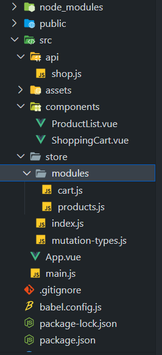

# [基本使用](#tip-1)

# [基本概念](#tip-2)

# [购物车实列](#tip-3)

目录结构



<a id="tip-1">基本使用</a>

```
vue create test-v-x
```

```
npm install vuex
```

main.js

```javascript
import Vue from "vue";
import App from "./App.vue";
import Vuex from "vuex";

Vue.use(Vuex);
Vue.config.productionTip = false;

const store = new Vuex.Store({
  state: {
    count: 0,
  },
  mutations: {
    increment(state, n) {
      state.count += n;
    },
  },
  // 处理异步操作并不能直接修改state
  actions: {
    increment({ commit }) {
      setTimeout(() => {
        commit("increment", 1);
      }, 3000);
    },
  },
});

new Vue({
  store,
  render: (h) => h(App),
}).$mount("#app");
```

app.vue

```html
<template>
  <div id="app">
    {{ count }}
    <button @click="$store.commit('increment',2)">count+n</button>
    <button @click="$store.dispatch('increment')">count++</button>
  </div>
</template>

<script>
  export default {
    name: "App",
    components: {},
    computed: {
      count() {
        return this.$store.state.count;
      },
    },
  };
</script>

<style></style>
```

<a id="tip-2">基本概念</a>

state:提供一个全局响应式数据

getter:借助 vue 计算属性 computed 来实现缓存

mutations:更改 state 方法

actions:（异步操作）触发 mutation 方法

module:模块化

---

<a id="tip-3">vuex 购物车实列</a>

先设计一个 src 下的 store 文件夹

目录为

一个 module 文件夹下的 cart.js 和 product.js

index.js 与 mutation-type.js

cart.js

```javascript
import shop from "../../api/shop";
import { CART, PRODUCTS } from "../mutation-types";

const state = {
  items: [],
  //购物车状态，默认为null。其他分为successful和failed
  checkoutStatus: null,
};

const getters = {
  cartProducts: (state, getters, rootState) => {
    return state.items.map(({ id, quantity }) => {
      //全局state
      const product = rootState.products.all.find(
        (product) => product.id === id
      );
      return {
        title: product.title,
        price: product.price,
        quantity,
      };
    });
  },
  cartTotalPrice: (state, getters) => {
    return getters.cartProducts.reduce((total, product) => {
      return total + product.price * product.quantity;
    }, 0);
  },
};

const actions = {
  checkout({ commit, state }, products) {
    //清空购物车状态
    const savedCartItems = [...state.items];
    commit(CART.SET_CHECKOUT_STATUS, null);
    //清空购物车数据
    commit(CART.SET_CART_ITEMS, { items: [] });
    shop.buyProducts(
      products,
      () => commit(CART.SET_CHECKOUT_STATUS, "successful"),
      () => {
        commit(CART.SET_CHECKOUT_STATUS, "failed");
        //把之前备份的购车车数据还原
        commit(CART.SET_CART_ITEMS, { items: savedCartItems });
      }
    );
  },
  addProductToCart({ state, commit }, { product, number }) {
    commit(CART.SET_CHECKOUT_STATUS, null);
    //如果商品的数量大于零
    if (product.inventory > 0) {
      //查找购物车是否有该商品
      const cartItem = state.items.find((item) => item.id === product.id);
      if (!cartItem) {
        //如果没找到则购物车添加产品
        commit(CART.PUSH_PRODUCT_TO_CART, { id: product.id, number });
      } else {
        //否则购物车内的商品添加数量
        commit(CART.INCREMENT_ITEM_QUANTITY, { cartItem, number });
      }
      commit(
        //利用命名空间调用其他module的mutation,比如商品减一
        `products/${PRODUCTS.DECREMENT_PRODUCT_INVENTORY}`,
        { id: product.id, number },
        { root: true }
      );
    }
  },
};

const mutations = {
  //添加商品到购物车
  [CART.PUSH_PRODUCT_TO_CART](state, { id, number }) {
    state.items.push({
      id,
      quantity: number,
    });
  },
  //购物车数量加一
  [CART.INCREMENT_ITEM_QUANTITY](state, { cartItem: { id }, number }) {
    const cartItem = state.items.find((item) => item.id === id);
    cartItem.quantity += number;
  },
  //设置购物车数量
  [CART.SET_CART_ITEMS](state, { items }) {
    state.items = items;
  },
  //设置购物车状态
  [CART.SET_CHECKOUT_STATUS](state, status) {
    state.checkoutStatus = status;
  },
};

export default {
  namespaced: true,
  state,
  getters,
  actions,
  mutations,
};
```

product.js

```javascript
import shop from "../../api/shop";
import { PRODUCTS } from "../mutation-types";

const state = {
  all: [],
};

const getters = {};

const actions = {
  getAllProducts({ commit }) {
    shop.getProducts((products) => {
      commit(PRODUCTS.SET_PRODUCTS, products);
    });
  },
};

const mutations = {
  //初始化商品
  [PRODUCTS.SET_PRODUCTS](state, products) {
    state.all = products;
  },
  //商品的数量减一
  [PRODUCTS.DECREMENT_PRODUCT_INVENTORY](state, { id, number }) {
    const product = state.all.find((product) => product.id === id);
    product.inventory -= number;
  },
};

export default {
  namespaced: true,
  state,
  getters,
  actions,
  mutations,
};
```

index.js

```javascript
import Vue from "vue";
import Vuex from "vuex";
import cart from "./modules/cart";
import products from "./modules/products";

Vue.use(Vuex);
export default new Vuex.Store({
  state: {
    userInfo: {
      email: "xxxx@163.com",
    },
  },
  modules: {
    cart,
    products,
  },
});
```

mutation-type.js

```javascript
export const CART = {
  PUSH_PRODUCT_TO_CART: "pushProductToCart",
  INCREMENT_ITEM_QUANTITY: "incrementItemQuantity",
  SET_CART_ITEMS: "setCartItems",
  SET_CHECKOUT_STATUS: "setCheckoutStatus",
};

export const PRODUCTS = {
  SET_PRODUCTS: "setProducts",
  DECREMENT_PRODUCT_INVENTORY: "decrementProductInventory",
};
```

另外我们需要一个 api 文件夹下的 shop.js，设计商品数据

shop.js

```javascript
const _products = [
  { id: 1, title: "华为 mate 20", price: 3999, inventory: 2 },
  { id: 2, title: "小米 9", price: 2999, inventory: 0 },
  { id: 3, title: "OPPO r17", price: 1999, inventory: 5 },
];

export default {
  getProducts(cd) {
    setTimeout(() => {
      return cd(_products);
    }, 100);
  },
  buyProducts(products, cd, errorCd) {
    setTimeout(() => {
      // 随机判断购物车提交成功与否
      Math.random() > 0.5 ? cd() : errorCd();
    }, 100);
  },
};
```

之后src下的main.js

main.js

```javascript
import Vue from "vue";
import App from "./App.vue";
import store from './store'

Vue.config.productionTip = false;

new Vue({
  store,
  render: (h) => h(App),
}).$mount("#app");
```

之后开始写组件

components下的ProductList.vue和ShoppingCart.vue

ProductList.vue

```html
<template>
  <ul>
    <li v-for="product in products" :key="product.id">
      {{ product.title }} - {{ product.price }}
      <br />
      <div>
        数量：
        <select v-model="numbers[product.id]">
          <option v-for="n in product.inventory" :key="n" :value="n">
            {{ n }}
          </option>
        </select>
      </div>
      <button :disabled="!product.inventory" @click="addProductToCart(product)">
        加入购物车
      </button>
    </li>
  </ul>
</template>

<script>
//映射全局变量的简写
import { mapState } from "vuex";
export default {
  data() {
    return {
      numbers: {},
    };
  },
  watch: {
    // 添加 immediate: true 后该回调将会在侦听开始之后被立即调用
    products: {
      handler: function(val) {
        val.forEach((product) => {
          if (this.numbers[product.id] === undefined) {
            this.$set(this.numbers, product.id, 1);
          }
        });
      },
      immediate: true,
    },
  },
  computed: mapState({
    products: (state) => state.products.all,
  }),
  // computed: {
  //   products(){
  //     return this.$store.state.products.all
  //   }
  // },
  // methods: mapActions("cart", ["addProductToCart"]),
  // methods: {
  //   addProductToCart(product){
  //     this.$store.dispatch('cart/addProductToCart', product)
  //   }
  // },
  methods: {
    addProductToCart(product) {
      this.$store.dispatch("cart/addProductToCart", {
        product,
        number: this.numbers[product.id],
      });
      this.numbers[product.id] = 1;
    },
  },
  created() {
    this.$store.dispatch("products/getAllProducts");
  },
};
</script>

<style></style>
```

ShoppingCart.vue

```html
<template>
  <div class="cart">
    <h2>清单</h2>
    <p v-show="!products.length"><i>请添加产品到购物车</i></p>
    <ul>
      <li v-for="product in products" :key="product.id">
        {{ product.title }} - {{ product.price }} x {{ product.quantity }}
      </li>
    </ul>
    <p>合计: {{ total }}</p>
    <p>
      <button :disabled="!products.length" @click="checkout(products)">
        提交
      </button>
    </p>
    <p v-show="checkoutStatus">提交 {{ checkoutStatus }}.</p>
  </div>
</template>

<script>
import { mapGetters, mapState } from "vuex";
export default {
  computed: {
    ...mapState({
      checkoutStatus: (state) => state.cart.checkoutStatus,
    }),
    ...mapGetters("cart", {
      products: "cartProducts",
      total: "cartTotalPrice",
    }),
    // ...mapGetters({
    //   products: 'cart/cartProducts',
    //   total: 'cart/cartTotalPrice'
    // })
  },
  // computed: {
  //   checkoutStatus(){
  //     return this.$store.state.cart.checkoutStatus
  //   },
  //   products() {
  //     return this.$store.getters['cart/cartProducts']
  //   },
  //   total() {
  //     return this.$store.getters['cart/cartTotalPrice']
  //   }
  // },
  methods: {
    checkout(products) {
      this.$store.dispatch("cart/checkout", products);
    },
  },
};
</script>

<style></style>

```

src下的App.vue

```html
<template>
  <div id="app">
    <h1>购物车示例</h1>
    <p>账号:{{ email }}</p>
    <hr />
    <h2>产品</h2>
    <product-list></product-list>
    <hr />
    <shopping-cart></shopping-cart>
  </div>
</template>

<script>
import { mapState } from "vuex";
import ProductList from "./components/ProductList.vue";
import ShoppingCart from "./components/ShoppingCart.vue";
export default {
  name: "App",
  components: { ProductList, ShoppingCart },
  computed: mapState({
    email: (state) => state.userInfo.email,
  }),
};
</script>

<style></style>

```

