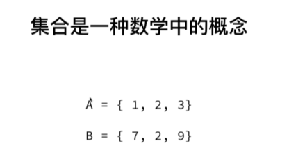
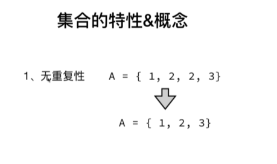
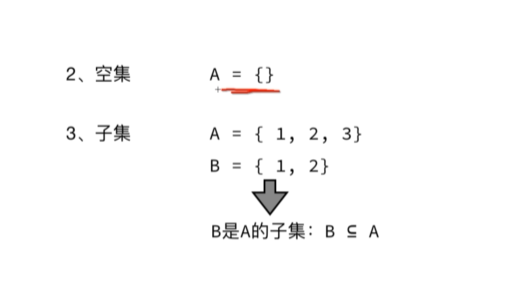
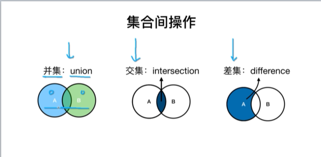
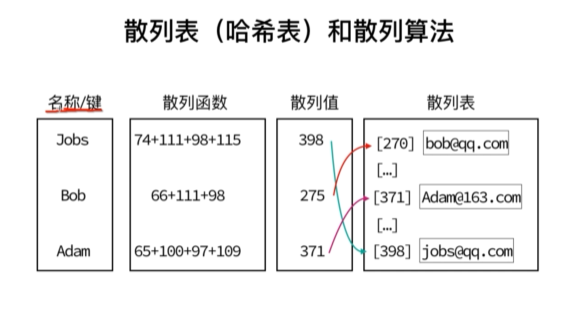
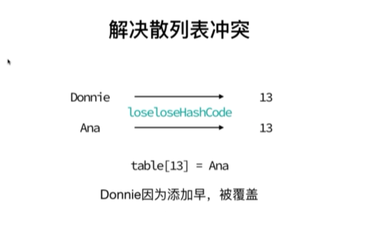

# 数据结构与算法

数据是是计算机的基础 算法是计算机的科学

[栈](#tip-1)

[队列](#tip-2)

[链表](#tip-3)

[集合](#tip-4)

[字典](#tip-5)

[哈希表](#tip-6)

---

## <a id="tip-1">栈</a>

栈的实现非常类似数组，是一种先进后出的数据结构


[1,2,3,4,5,6]

1 作为栈底
6 作为栈顶
数组的 push (进栈)和 pop (出栈)操作都是在栈顶操作的

栈的数组实现

```javascript
class Stack {
  constructor() {
    this.arr = [1, 2, 3];
  }
  //入栈
  azPush(item) {
    this.arr.push(item);
  }
  //出栈
  azPop() {
    return this.arr.pop();
  }
  //查看栈头
  peek() {
    return arr[this.arr.length - 1];
  }
  //检查栈
  getarr() {
    return this.arr;
  }
  //检查栈是否为空
  isEmpty() {
    return this.arr.length == 0;
  }
  //清空栈
  clear() {
    return (this.arr = []);
  }
  //获取栈大小
  size() {
    return this.arr.length;
  }
}
```

十进制转二进制


```javascript
function getTwo(number) {
  const arr = [];
  let yushu = null;
  let str = "";

  while (number > 0) {
    yushu = number % 2;
    arr.push(yushu);
    number = Math.floor(number / 2);
  }

  while (arr.length > 0) {
    str += arr.pop();
  }

  return str;
}
```

函数栈顺序


```javascript
function fooi() {
  return console.log("foo i finish");
}

function fooii() {
  fooi();
  return console.log("foo ii finish");
}

//先调用先入栈
fooii();
```

## <a id="tip-2">队列</a>

栈的实现非常类似数组，是一种先进先出的数据结构


```javascript
class Queue {
  constructor() {
    this.arr = [];
  }
  //入队
  enqueue(item) {
    arr.push();
  }
  //出队
  dequeue() {
    return this.arr.shift();
  }
  //查看队头
  fornt() {
    return this.arr[0];
  }
  //查看队是否为空
  isEmpty() {
    return this.arr.length == 0;
  }
  //队大小
  size() {
    return this.arr.length;
  }
}
```

丢手绢游戏实现队列

```javascript
function go(number) {
  const names = ["a", "b", "c", "d", "e", "f"];
  let total = null;
  while (names.length > 1) {
    for (let i = 0; i < number - 1; i++) {
      names.push(names.shift());
    }
    //踢走中手绢的人
    total = names.shift();
    console.log("淘汰的玩家是 -" + total);
  }
  return names.shift();
}

console.log(go(3));
```

数组实现队列优先级

```javascript
const list = [
  { id: 1, priority: 6 },
  { id: 2, priority: 5 },
  { id: 3, priority: 3 },
];

function priority(item) {
  flag = false;

  for (let index = 0; index < list.length; index++) {
    if (item.priority > list[index].priority) {
      list.splice(index, 0, item);
      flag = true;
      break;
    }
  }

  if (!flag) list.push(item);
}

priority({ id: 4, priority: 5 });

console.log(list);
```

## <a id="tip-3">链表</a>


类实现链表尾添加元素

```javascript
class Chain {
  constructor() {
    this.head = null;
    this.length = 0;
  }
  append(element) {
    const node = new Node(element);
    if (this.head == null) {
      //第一轮
      this.head = node;
    } else {
      let current = this.head;
      //第三轮
      while (current.next) {
        current = current.next;
      }
      //第二轮
      current.next = node;
    }
    this.length++;
  }
  insert(position, element) {
    //插入范围,第一个node位置为0，所以不能大于length
    if (position > -1 && position < this.length) {
      const node = new Node(element);
      if (position == 0) {
        let current = this.head;
        this.head = node;
        //插入的效果与splice一样
        this.head.next = current;
      } else {
        let index = 0;
        let current = this.head;
        let previous = null;
        //循环弄node对象，确保index小于positon 1
        while (index < position) {
          previous = current;
          current = current.next;
          index++;
        }
        //通过循环重新赋值，保存位置
        previous.next = node;
        node.next = current;
      }
      this.length++;
    }
  }
  removeAt(position) {
    if (position > -1 && position < this.length) {
      let current = null;
      if (position == 0) {
        current = this.head;
        //通过对象的重新赋值达到删除的效果
        this.head = current.next;
      } else {
        current = this.head;
        let previous = null;
        let index = 0;
        while (index < position) {
          previous = current;
          current = current.next;
          index++;
        }
        previous.next = current.next;
      }
      this.length--;
      return current;
    }
  }
  indexOf(element) {
    let current = this.head;
    let index = 0;
    while (current) {
      if (current.element === element) {
        return index;
      }
      current = current.next;
      index++;
    }
    return -1;
  }
  remove(element) {
    //传参需要的是值不是下标
    return this.removeAt(this.indexOf(element));
  }
  isEmpty() {
    return this.length == 0;
  }
  size() {
    return this.length;
  }
  getHead() {
    return this.head;
  }
}

class Node {
  constructor(element) {
    this.element = element;
    this.next = null;
  }
}

const c = new Chain();
c.append(1);
c.append(2);
c.append(3);

c.insert(1, 10);

c.remove(1);

//c.removeAt(0)

//console.log(c.indexOf(10))

console.log(c.getHead());
```

## <a id="tip-4">集合</a>

集合和 JavaScript 中的对象非常相识









```javascript
class Set2 {
  constructor() {
    this.items = {};
  }
  has(value) {
    return this.items.hasOwnProperty(value);
  }
  add(value) {
    if (this.has(value)) {
      return false;
    } else {
      this.items[value] = value;
      return value;
    }
  }
  remove(value) {
    if (this.has(value)) {
      delete this.items[value];
      return true;
    } else {
      return false;
    }
  }
  clear() {
    this.items = {};
  }
  size() {
    let count = 0;
    for (let i in this.items) {
      if (this.items.hasOwnProperty(i)) count++;
    }
    return count;
    //新语法更简洁
    //return Object.keys(items).length
  }
  values() {
    let values = [];
    for (let i in this.items) {
      if (this.items.hasOwnProperty(i)) values.push(this.items[i]);
    }
    return values;
  }
  union(otherSet) {
    const resultSet = new Set2();
    let arr = this.values();

    for (let i = 0; i < arr.length; i++) {
      resultSet.add(arr[i]);
    }

    arr = otherSet.values();
    for (let i = 0; i < arr.length; i++) {
      resultSet.add(arr[i]);
    }

    return resultSet;
  }
  intersection(otherSet) {
    const resultSet = new Set2();
    let arr = this.values();

    for (let i = 0; i < arr.length; i++) {
      if (otherSet.has(arr[i])) resultSet.add(arr[i]);
    }
    return resultSet;
  }
  difference(otherSet) {
    const resultSet = new Set2();
    let arr = this.values();

    for (let i = 0; i < arr.length; i++) {
      if (otherSet.has(arr[i])) {
      } else {
        resultSet.add(arr[i]);
      }
    }
    return resultSet;
  }
  getItems() {
    return this.items;
  }
}

//   const s = new Set2()
//   s.add(1)
//   s.add(2)
//   s.add(3)
//   s.remove(1)
//   console.log(s.values())

//   var A = new Set2();
//   A.add(1);
//   A.add(2);
//   A.add(3);

//   var B = new Set2();
//   B.add(2);
//   B.add(3);
//   B.add(4);

//实现并集
//   var result = A.union(B);
//   console.log(result.values());

//实现交集
//console.log(A.intersection(B).values())

//实现差集
//A主B副，B属性没有1，所以只有1
//B主A副，A属性没有4，所以只有4
//console.log(A.difference(B).values());

//es6实现集合
//Set属于强引用，weakSet属于弱引用
//Set不利于垃圾回收weakSet可以比Set能加节省内存
// const a = new Set([1, 2, 3]);
// const b = new Set([4, 3, 2]);

//并集
// const union = new Set([...a, ...b]);

//交集
// const intersect = new Set(
//   [...a].filter((i) => {
//     return b.has(i);
//   })
// );

//差集
// const different = new Set([...a].filter(i => {
//   return !b.has(i)
// }))
```

## <a id="tip-5">字典</a>

```javascript
class Dictionary {
  constructor() {
    this.items = {};
  }
  has(key) {
    return key in this.items;
  }
  set(key, value) {
    this.items[key] = value;
  }
  delete(key) {
    if (this.has(key)) {
      delete this.items[key];
      return true;
    }
    return false;
  }
  get(key) {
    if (this.has(key)) {
      return this.items[key];
    }
    return undefined;
  }
  getItems() {
    return this.items;
  }
}

const d = new Dictionary();
d.set("price", 200);
d.set("name", "小明");
console.log(d.getItems());
console.log(d.get("price"));
console.log(d.delete("price"));
console.log(d.getItems());
```

<a id="tip-6">哈希表</a>






