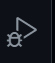
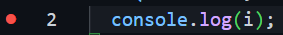

> nodejs 调试

- 新建一个 npm 项目

```bash
npm init -y
```

- 注意入口文件要与 package.json 的 main 键一致

- 在 vscode 中打开项目

- index.js

```javascript
for (let i = 0; i <= 10; i++) {
  console.log(i);
}
```

- 点击调试



- 锁定第二行



- 接着就可以一步一步观察执行代码了


